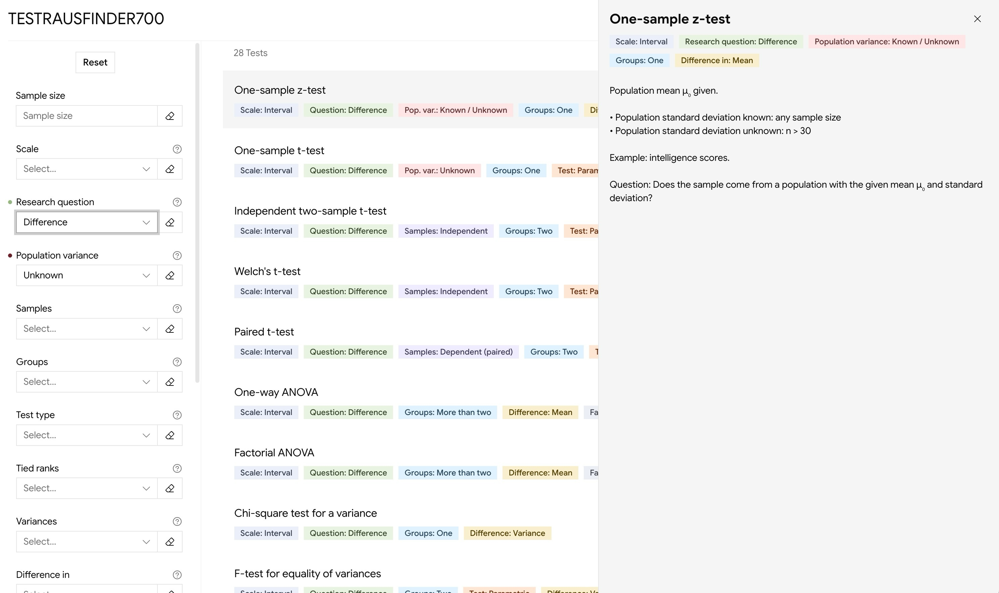

## TESTRAUSFINDER700

This is a website that helps statistics students to find out which statistical tests they can use for a given problem/dataset.

It is built as a testing ground to learn new technologies.

## Features
- Webapp built on Next.js that lets you narrow down viable tests by selecting known constraints.
- MCP server that exposes the functionality to agents.
